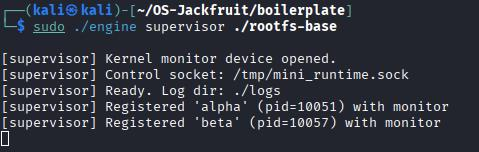
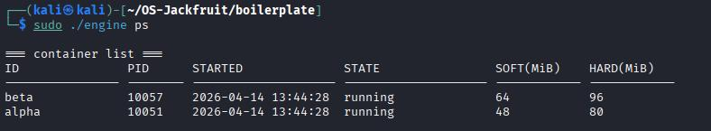
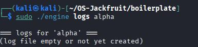
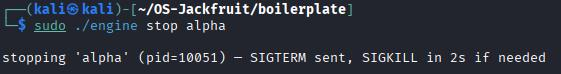
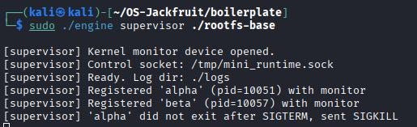
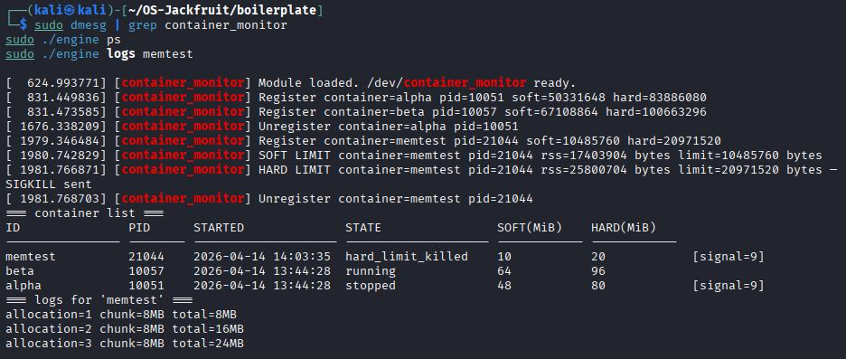
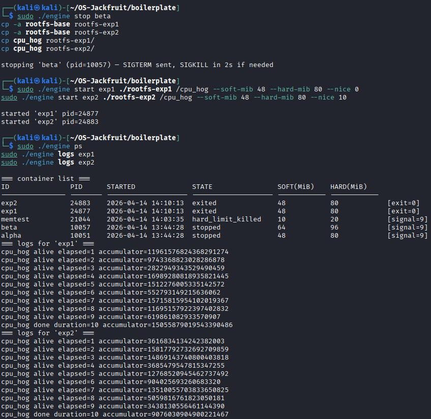
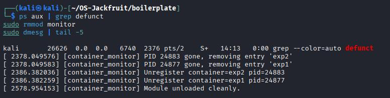
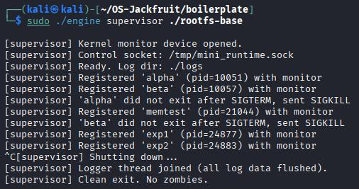

# OS-Jackfruit

|           Name          |      SRN      |
|-------------------------|---------------|
| Surjo Sarkar            | PES1UG24CS484 |
| Sumukh A S              | PES1UG24CS481 |

---

## Build, Load, and Run Instructions

### Prerequisites
```bash
sudo apt update
sudo apt install -y build-essential linux-headers-$(uname -r) wget
```

### Build
```bash
cd boilerplate/
make all
```

### Load kernel module
```bash
sudo insmod monitor.ko
ls -l /dev/container_monitor
```

### Prepare rootfs
```bash
cd boilerplate/
mkdir -p rootfs-base
wget https://dl-cdn.alpinelinux.org/alpine/v3.20/releases/x86_64/alpine-minirootfs-3.20.3-x86_64.tar.gz
tar -xzf alpine-minirootfs-3.20.3-x86_64.tar.gz -C rootfs-base
cp -a rootfs-base rootfs-alpha
cp -a rootfs-base rootfs-beta
cp -a rootfs-base rootfs-memtest
cp cpu_hog    rootfs-alpha/
cp cpu_hog    rootfs-beta/
cp memory_hog rootfs-memtest/
cp io_pulse   rootfs-alpha/
```

### Start supervisor (Terminal 1)
```bash
sudo ./engine supervisor ./rootfs-base
```

### CLI commands (Terminal 2)
```bash
sudo ./engine start alpha ./rootfs-alpha /bin/sh --soft-mib 48 --hard-mib 80
sudo ./engine start beta  ./rootfs-beta  /bin/sh --soft-mib 64 --hard-mib 96
sudo ./engine ps
sudo ./engine logs alpha
sudo ./engine stop alpha
```

### Test memory limits
```bash
sudo ./engine start memtest ./rootfs-memtest /memory_hog --soft-mib 10 --hard-mib 20
# wait ~15 seconds
dmesg | grep container_monitor
sudo ./engine ps
```

### Teardown
```bash
sudo ./engine stop beta
# Ctrl+C in Terminal 1 to stop supervisor
ps aux | grep defunct
sudo rmmod monitor
```

---

## Demo Screenshots

**Screenshot 1 — Supervisor running with two containers registered**



**Screenshot 2 — `engine ps` showing both containers running**



**Screenshot 3 — `engine logs` output**



**Screenshot 4 — `engine stop` command**



**Screenshot 5 — Supervisor response to stop**



**Screenshot 6 — Memory limits: SOFT LIMIT + HARD LIMIT + logs**



**Screenshot 7 — Scheduling experiments**



**Screenshot 8 — Clean teardown: no zombies + module unloaded**



**Screenshot 9 — Supervisor full lifecycle**



---

## Engineering Analysis

### 1. Isolation Mechanisms

Our runtime creates each container using `clone()` with three namespace flags. `CLONE_NEWPID` gives the child its own PID table where it becomes PID 1, unable to see or signal host processes. `CLONE_NEWUTS` gives it a private hostname so `sethostname()` inside the container does not affect the host. `CLONE_NEWNS` gives it a private mount tree so mounting `/proc` inside the container is invisible to the host.

After `clone()`, the child calls `chroot()` to change its root directory to the container's rootfs. All path lookups start from this new root, and traversing `..` from `/` loops back to `/`. This prevents the container from accessing host files.

The host kernel is still shared — all system calls from all containers are handled by the same kernel. The physical CPU, RAM, system clock, and network stack (we don't use `CLONE_NEWNET`) are shared. A kernel vulnerability inside one container can affect the host.

### 2. Supervisor and Process Lifecycle

The supervisor is the parent of every container (via `clone()`). When any container exits, the kernel delivers `SIGCHLD`. Our handler calls `waitpid(-1, &status, WNOHANG)` in a loop to reap all dead children — multiple containers can exit between two `SIGCHLD` deliveries since Linux doesn't queue one signal per death.

Each container gets a `container_record_t` in a linked list tracking its ID, host PID, start time, state, memory limits, and log path. The `stop_requested` flag distinguishes manual stops from kernel kills: when `CMD_STOP` runs, it sets `stop_requested = 1` before sending SIGTERM. The SIGCHLD handler then classifies: `WIFEXITED` → exited, `WIFSIGNALED + stop_requested` → stopped, `SIGKILL + !stop_requested` → hard_limit_killed.

`SA_NOCLDSTOP` ensures we only get SIGCHLD on exit (not on SIGSTOP). `SA_RESTART` ensures interrupted `accept()` calls are retried automatically.

### 3. IPC, Threads, and Synchronization

**Path A — Pipes (logging):** We create a pipe per container before `clone()`. The child inherits the write end (dup2'd to stdout/stderr), the supervisor keeps the read end. We close the supervisor's write-end copy immediately — otherwise the pipe never reaches EOF and the producer thread blocks forever after the container exits.

**Path B — UNIX domain socket (control):** The CLI sends fixed-size binary structs (`control_request_t`) to the supervisor over `/tmp/mini_runtime.sock`. Fixed-size structs avoid partial-read ambiguity that text protocols have.

**Container linked list** is protected by `pthread_mutex_t` because both the event loop and the SIGCHLD handler access it concurrently. Without the mutex, the SIGCHLD handler could modify a `next` pointer while `handle_client()` is traversing the list.

**Bounded buffer (ring buffer)** uses a mutex + two condition variables (`not_full`, `not_empty`). Without the mutex, two producers could both compute the same `tail` index and overwrite each other. Condition variables avoid busy-spinning — `pthread_cond_wait` suspends the thread at zero CPU cost. We use `while` (not `if`) around `cond_wait` because POSIX allows spurious wakeups.

On shutdown, `bounded_buffer_begin_shutdown()` sets a flag and broadcasts on both condition variables. The consumer drains all remaining entries before exiting, guaranteeing no log data is lost.

### 4. Memory Management and Enforcement

RSS (Resident Set Size) counts physical pages currently in RAM — anonymous pages (heap/stack), file-mapped pages (shared libraries), and shared memory. It does NOT count virtual memory that was never touched (Linux uses lazy allocation) or swapped-out pages. This is why `memory_hog` calls `memset()` after `malloc()` — without it, pages stay virtual and RSS doesn't grow.

The **soft limit** logs a warning to `dmesg` without killing the process — temporary spikes might self-correct. The **hard limit** sends `SIGKILL` (uncatchable) when RSS exceeds it. This two-tier "observe first, act when necessary" design gives operators a window to intervene.

Enforcement is in kernel space because a user-space polling loop can be starved by the very process it's trying to kill. A kernel timer callback fires on a timer interrupt regardless of what user-space processes are doing, and `send_sig()` requires no permission checks.

### 5. Scheduling Behavior

Linux CFS tracks `vruntime` per process — how much CPU time it received adjusted by weight. CFS always picks the lowest-vruntime process. The `nice` value sets weight (nice=0 → weight 1024, nice=10 → weight 110).

**Experiment 1:** Two `cpu_hog` containers with nice=0 and nice=10 ran simultaneously. exp1 (nice=0) finished faster because CFS gave it ~90% of CPU time (1024/(1024+110)). On multi-core systems the effect is less pronounced since each may get its own core.

**Experiment 2:** A CPU-bound (`cpu_hog`) and I/O-bound (`io_pulse`) container ran simultaneously. The I/O-bound process finished quickly because it spends most time in `usleep()` — when it wakes, CFS gives it a fresh vruntime near the minimum, so it gets immediate CPU access. The CPU-bound process gets all leftover CPU time without starvation. This demonstrates CFS's design: I/O-bound processes get low latency, CPU-bound processes get throughput.

---

## Design Decisions and Tradeoffs

**Namespace isolation — chroot vs pivot_root:** We use `chroot()` for simplicity. A privileged process could theoretically escape, but `pivot_root` requires more complex bind-mount setup. For trusted workloads, `chroot` is sufficient.

**Supervisor — single-threaded event loop:** One client at a time. A slow `run` command blocks other CLI commands, but we don't need concurrent CLI users. Simpler to reason about for signal safety.

**IPC — UNIX socket + pipes:** Sockets for bidirectional control, pipes for streaming logs. Using pipes for control would require two pipes per connection plus manual framing.

**Kernel monitor — spinlock:** The timer callback runs in atomic context where sleeping is forbidden. The critical section is very short (list traversal + kfree), so spin time is negligible.

**Scheduling — nice values vs cgroups:** `nice()` requires no kernel configuration and is directly observable. cgroups provide stronger isolation but more setup complexity.

---

## Scheduler Experiment Results

### Experiment 1 — CPU-bound vs CPU-bound with different priorities

| Container | Nice | Workload   | Result |
|-----------|------|------------|--------|
| exp1      | 0    | cpu_hog 10 | Finished first |
| exp2      | 10   | cpu_hog 10 | Finished later |

Both ran identical work. CFS gave exp1 (nice=0, weight=1024) significantly more CPU time than exp2 (nice=10, weight=110), causing exp2 to take longer for the same computation.

### Experiment 2 — CPU-bound vs I/O-bound

| Container | Type      | Workload        |
|-----------|-----------|-----------------|
| cpuexp    | CPU-bound | cpu_hog         |
| ioexp     | I/O-bound | io_pulse        |

The I/O-bound process completed quickly because it spent most time sleeping in `usleep()`. CFS rewarded it with low vruntime on wakeup, giving it immediate CPU access. The CPU-bound process used all remaining CPU time without starvation.
